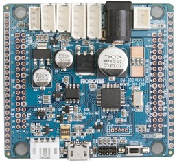
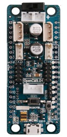

# Maple Bootloader for Robotis boards

This is an adaptation of the maple bootloader in order to make it work with the
Robotis CM900 and OpenCM9.04 boards:

* [Robotis CM900](http://support.robotis.com/en/product/auxdevice/controller/cm-900_manual.htm)
* [Robotis OpenCM9.04](http://support.robotis.com/en/product/auxdevice/controller/opencm9.04.htm)

## How to install it?

### Step 1. build or get the right bootloader

You can either build it or get it (from the `snapshot` directory).

### Step 2. wire a serial line to your board

This step may require some soldering or electronic hacking, you'll have to wire up a serial 3.3V 
adapter. You can for instance use a [3.3V FTDI cable](http://www.ftdichip.com/Products/Cables/USBTTLSerial.htm)
or a [3.3V FTDI Breakout](https://www.sparkfun.com/products/retired/8772). 5V logic should also
work with this.

Then, wire your serial adapter to the Serial1 (TX1 and RX1) pins of your board.

### Step 3. Put your board in hardware bootloader mode

Press the RESET button of your board, and then put the BOOT0 signal to 3.3V (this can be done
with an extra wire) and release the RESET button.

### Step 4. Flash the bootloader!

You can now flash the bootloader:

```
# You may have to adapt the serial port, this is an example:
python stm32loader.py -p /dev/ttyUSB -evw bootloader.bin
```

Tada! It should then be OK.

### Step 5. What's next?

Next, you can program your board using `dfu-util`. This is done by default in the libmaple
Makefile.

Here is a repository forking the libmaple and adding a `cm900` and `opencm904` board to it:
[RobotsWar libmaple (including robotis boards](https://github.com/RobotsWar/libmaple)

## CM900



The `master` branch of this repository is supporting CM900 board, you can find a
snapshot of the bootloader in `snapshot/maple-boot-cm900.bin`.

## OpenCM9.04



This variant is coming soon
